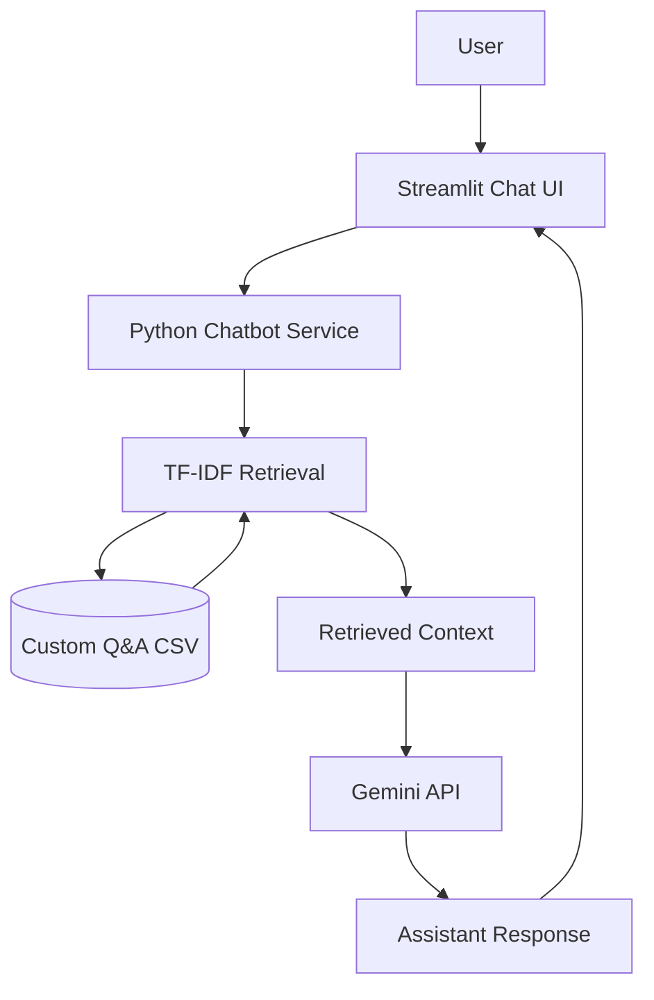

# TravelMate Architecture

```mermaid
flowchart TD
    A[User] --> B[Streamlit Chat UI]
    B --> C[Python Chatbot Service]
    C --> D[TF-IDF Retrieval]
    D --> E[(Custom Q&A CSV)]
    E --> D
    D --> F[Retrieved Context]
    F --> G[Gemini API]
    G --> H[Assistant Response]
    H --> B
```

Dataset-only mode returns the top retrieved answer without calling the LLM.
